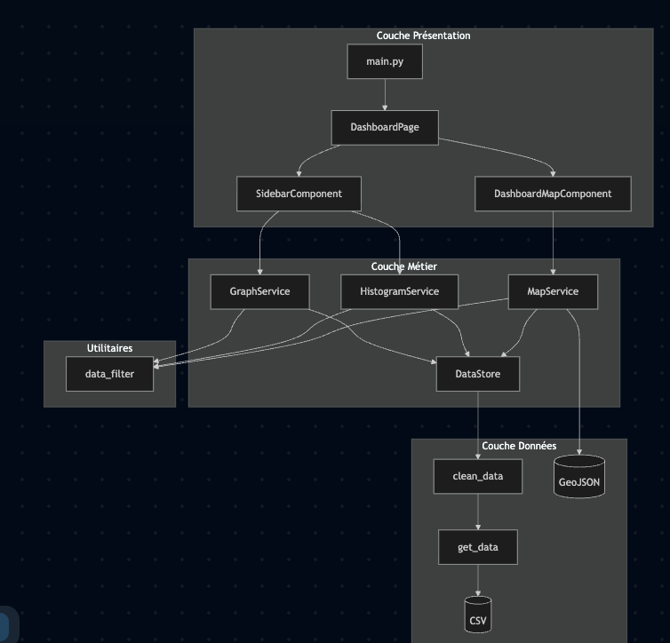

# 🦠 Dashboard COVID-19 dans les hopitaux en France

Visualisation interactive des données COVID-19 en France avec cartes choroplèthes, graphiques temporels et filtres dynamiques.

 (14 August 2025)
 (Jul 31 2025)
 (Aug 12 2025)
 (21 August 2025)

---
# Auteurs
@abdelrkb : REKKAB Abdelnour
@djambaxx : ZEROUAL Ilyes
---

# User Guide 

 ### Prérequis

 - **Python 3.13.7** Version la plus récente de python au 1er septembre 2025.
 - **pip** pour installation de dépendances

 ### Installation
 1. Cloner le projet
 ```bash
git clone https://github.com/abdelrkb/DataProject
cd DataProject
```

2. Créer un environnement virtuel
```bash
python -m venv venv
source venv/bin/activate  # Sur Mac/Linux
# OU
.\venv\Scripts\Activate.ps1  # Sur Windows
```

3. Installer dépendances
```bash
pip install -r requirements.txt
```

### Lancement
```bash
python main.py
#OU
python3 main.py
```
L'application sera accessible sur **http://127.0.0.1:8050**. 
/!\ S'assurer que le port est disponible sur votre machine /!\

### Utilisation

#### Interface principale

L'interface est divisée en deux zones : 

**1. Sidebar gauche**
- Header : Statistiques principales
- Filtres : 
    - Niveau Géographique : France Entière / Région / Département
    - Type de statistiques : Hospitalisations, réanimations, décès...
- Graphique Temporel : évolution temporel selon la statistique
- Histogramme : distribution par mois

**2. Sidebar gauche**
- Carte clorophète par rapport aux filtes de la sidebar

#### Interactions
1. Changer de niveau géographique :
   - "France entière" pour voir l'ensemble du pays
   - "Région" pour choisir une région
   - "Département" pour choisir un département

2. Changer de statistique :
   - Les graphiques, histogrammes et cartes se mettent à jour automatiquement
   - Chaque statistique a sa propre échelle de couleurs

3. Explorer la carte :
   - Survoler les régions/départements pour voir les détails

## 📊 Data
### Source des données
Les données proviennent de **Santé publique France** et couvrent la période du **1er avril 2020 au 30 juin 2023**.
Source : [data.gouv.fr - Données hospitalières COVID-19](https://www.data.gouv.fr/datasets/synthese-des-indicateurs-de-suivi-de-lepidemie-covid-19)

### Structure du dataset
Le fichier `covid_dataset.csv` contient les colonnes suivantes :
| Colonne | Description | Type |
|---------|-------------|------|
| `dep` | Code département (01-976) | string |
| `date` | Date de l'observation | date |
| `lib_dep` | Nom du département | string |
| `lib_reg` | Nom de la région | string |
| `hosp` | Nombre de patients hospitalisés | integer |
| `rea` | Nombre de patients en réanimation | integer |
| `rad` | Nombre de retours à domicile (cumulé) | integer |
| `dchosp` | Nombre de décès hospitaliers (cumulé) | integer |
| `incid_hosp` | Nouvelles hospitalisations | integer |
| `incid_rea` | Nouvelles admissions en réanimation | integer |
| `incid_rad` | Nouveaux retours à domicile | integer |
| `incid_dchosp` | Nouveaux décès hospitaliers | integer |

### Données dérivées
Le projet calcule également :
- `taux_mortalite` : Ratio décès / hospitalisations (%)
- `taux_rea` : Ratio réanimations / hospitalisations (%)
- `letalite` : Létalité par zone géographique (%)

### GeoJSON
- Les contours géographiques proviennent de [france-geojson.gregoiredavid.fr](https://france-geojson.gregoiredavid.fr)
- [Github](https://github.com/gregoiredavid/france-geojson/tree/master)

## 🛠️ Developer Guide
### Architecture du code

Le projet suit une **architecture modulaire en couches** (MVC-like) avec séparation stricte entre données, logique métier et interface.

#### Structure des dossiers
```bash
├── __init__.py
├── assets
│   └── global.css
├── config.py
├── contributing.md
├── data
│   ├── cleaned
│   │   └── covid_clean.csv
│   ├── geo
│   │   ├── departements.geojson
│   │   ├── guadeloupe.geojson
│   │   ├── guyane.geojson
│   │   ├── martinique.geojson
│   │   ├── mayotte.geojson
│   │   ├── regions.geojson
│   │   └── reunion.geojson
│   └── raw
│       └── covid_dataset.csv
├── images
├── main.py
├── pyproject.toml
├── readme.md
├── render.yaml
├── requirements-dev.txt
├── requirements.txt
└── src
    ├── __init__.py
    ├── components
    │   ├── __init__.py
    │   ├── base
    │   │   └── base_component.py
    │   ├── dashboard_map_component.py
    │   └── sidebar_component.py
    ├── pages
    │   ├── __init__.py
    │   ├── base
    │   │   └── base_page.py
    │   └── home_page.py
    ├── services
    │   ├── base
    │   │   ├── base_service.py
    │   │   └── datastore.py
    │   ├── graphs_service.py
    │   ├── histogram_service.py
    │   ├── map_service.py
    │   ├── reference_service.py
    │   └── stats_service.py
    └── utils
        ├── __init__.py
        ├── clean_data.py
        ├── data_filter.py
        └── get_data.py
```

#### Diagramme d'architecture (Mermaid)


#### Diagramme de classes


### Ajouter une nouvelle page
1. Créer la classe dans `src/pages/nouvelle_page.py` :
```python
from dash import html
from src.pages.base.base_page import BasePage

class NouvellePage(BasePage):
    def __init__(self):
        # Initialiser les composants
        pass

    def layout(self):
        return html.Div([
            html.H1("Ma nouvelle page"),
            # Contenu...
        ])

    def register_callbacks(self, app):
        # Enregistrer les callbacks
        pass
```

2. Ajouter la route dans `main.py` :
```python
from src.pages.nouvelle_page import NouvellePage

nouvelle_page = NouvellePage()

@app.callback(Output("page-content", "children"), Input("url", "pathname"))
def display_page(pathname):
    if pathname == "/":
        return dashboard_page.layout()
    elif pathname == "/nouvelle":
        return nouvelle_page.layout()
    return html.H1("404 - Page non trouvée")

nouvelle_page.register_callbacks(app)
```

### Ajouter un nouveau graphique
#### 1. Créer la méthode dans le service

Dans `src/services/graphs_service.py` :
```python
def nouveau_graphique(self, region=None, dep=None):
    """Description du graphique"""
    df = filter_by_geo(self.df, region=region, dep=dep)
    # Traitement des données...
    return df.groupby("date", as_index=False)[["colonne"]].sum()
```

#### 2. Ajouter au composant

Dans `src/components/sidebar_component.py`, ajouter à `stat_types` :

```python
self.stat_types["nouveau"] = {
    "label": "Nouveau Graphique",
    "graph_method": self.graph_service.nouveau_graphique,
    "hist_method": self.histogram_service.methode_associee,
    "graph_col": "colonne",
    "hist_col": "colonne",
    "unit": "unité",
}
```

Le graphique apparaîtra automatiquement dans le dropdown ! (Même idée pour Histogrammes)

### Ajouter une nouvelle carte
Dans `src/services/map_service.py`, créer une méthode :

```python
def nouvelle_carte_map_html(self, level="region", region=None, dep=None):
    """Description de la carte"""
    df = filter_by_geo(self.df, region=region, dep=dep)
    
    # Choix du GeoJSON
    if level == "dep":
        geojson = self.geojson_dep
        name_col = "lib_dep"
    else:
        geojson = self.geojson_reg
        name_col = "lib_reg"
    
    # Agrégation
    df = df.groupby(name_col, as_index=False)[["colonne"]].sum()
    
    # Créer le choropleth
    m = self._create_base_map(center=[46.6, 2.5], zoom=6)
    choropleth = folium.Choropleth(
        geo_data=geojson,
        data=df,
        columns=[name_col, "colonne"],
        key_on="feature.properties.nom",
        fill_color="Blues",
        fill_opacity=0.7,
    ).add_to(m)
    
    return m._repr_html_()
```

### Principes de développement
1. Séparation des responsabilités :
   - Components = UI uniquement
   - Services = Logique métier et agrégation
   - Page = Pages pour le routing html
   - Utils = Fonctions utilitaires réutilisables

2. DataStore centralisé :
   - Les données sont chargées UNE SEULE FOIS
   - Mise en cache pour performance
   - Tous les services utilisent la même instance

3. Pas de logique dans les components :
   - Les components appellent les services
   - Les services retournent des DataFrames prêts à l'emploi
   - Les components affichent uniquement

4. Callbacks modulaires :
   - Chaque component enregistre ses propres callbacks
   - Utilisation de `cid()` pour des IDs uniques
   - Pas de callbacks globaux dans main.py


### Qualité de code

Le projet utilise **Ruff** pour garantir la qualité et la cohérence du code.

#### Installation des outils de développement
```bash
pip install -r requirements-dev.txt
```

#### Ruff - Linter et formateur

**Ruff** est un linter Python ultra-rapide qui remplace flake8, isort et black.

**Vérifier le code :**
```bash
ruff check .
```

**Corriger automatiquement :**
```bash
ruff check . --fix
```

**Formater le code :**
```bash
ruff format .
```

#### Pre-commit hooks

Le projet utilise **pre-commit** pour vérifier automatiquement le code avant chaque commit.

**Installer les hooks :**
```bash
pre-commit install
```

Les hooks s'exécuteront automatiquement à chaque `git commit` et bloqueront le commit si le code ne respecte pas les standards.

#### Configuration

La configuration de Ruff se trouve dans `pyproject.toml` :
- **Target** : Python 3.13
- **Line length** : 88 caractères (standard Black)
- **Rules** : Erreurs de syntaxe (E4, E7, E9) et erreurs Python (F)

#### CI/CD

Une GitHub Action (`/.github/workflows/ci.yml`) vérifie automatiquement le code sur chaque Pull Request vers `main`.

Voir le Contributing.MD pour plus d'informations sur la qualité de code.

---
## 📈 Rapport d'analyse

### Principales Conclusions

#### 1. Evolutions temporelle de l'épidemie
**Observations :**
- Vagues successives : 3 grandes vagues identifiables (2020, hiver 2020-2021, fin 2021)
- Pic d'hospitalisations
- Décroissance progressive : Grace aux confinements ou aux campagnes de vaccinations

**Graphique temporel France entière :**
- Première vague (avril 2020) : montée rapide, descente lente
- Deuxième vague (nov 2020) : plus intense, descente plus rapide (effet vaccination)
- Troisième vague (avril 2021) : moins intense mais plus longue

#### 2. Disparités régionales

**Régions les plus touchées (hospitalisations cumulées) :**
1. **Île-de-France**
2. **Auvergne-Rhône-Alpes**
3. **Hauts-de-France**

**Régions les moins touchées :**
1. **Corse**
2. **Centre-Val de Loire**

**Analyse :**
- Corrélation forte avec la densité de population
- L'Île-de-France représente ~15% des hospitalisations pour ~18% de la population
- Les régions rurales ont été moins impactées

#### 3. Taux de létalité
**Moyenne nationale** : 4.2% (décès hospitaliers / hospitalisations)

**Variations par période :**
- Première vague (mars-mai 2020) : 18-20% (système de santé saturé, pas de traitement)
- Deuxième vague (oct-déc 2020) : 12-15% (meilleure prise en charge)
- Post-vaccination (2021-2022) : 2-5% (vaccination efficace)

**Par région :**
- Grand Est : 5.1% (première région touchée, saturation)
- Île-de-France : 4.8%
- Bretagne : 3.2% (moins de saturation)

#### 4. Pression sur les réanimations
**Ratio réanimations/hospitalisations** :
- Pic : lors de la première vague
- Moyenne stable : en 2021-2022
- Amélioration : Meilleure détection précoce et traitements ambulatoires

Départements avec forte pression :
- Seine-Saint-Denis (93) 
- Val-d'Oise (95)
- Bouches-du-Rhône (13)

#### 5. Impact de la vaccination

**Corrélation visible sur les données** :
- Baisse de la létalité après 2021.

**Réduction du nombre d'hospitalisations**

### Limites de l'analyse

1. **Données hospitalières uniquement** : Ne comptabilise pas les décès en EHPAD ou à domicile
2. **Biais géographique** : Zones rurales potentiellement sous-représentées
3. **Période limitée** : Données jusqu'à juin 2023 uniquement

---

## 📜 Copyright
### Déclaration d'originalité
**Nous, REKKAB Abdelnour, ZEROUAL Ilyes déclaarons sur l'honneur que le code fourni a été produit par nous-même**

### Bibliothèques tierces utilisées
Toutes les bibliothèques externes sont listées dans `requirements.txt`:
- **Dash** Framework web interactif
- **Plotly** Graphiques interactifs
- **Folium** Cartes géographiques
- **Pandas** Manipulation de données
- **GeoPandas** Données géographiques